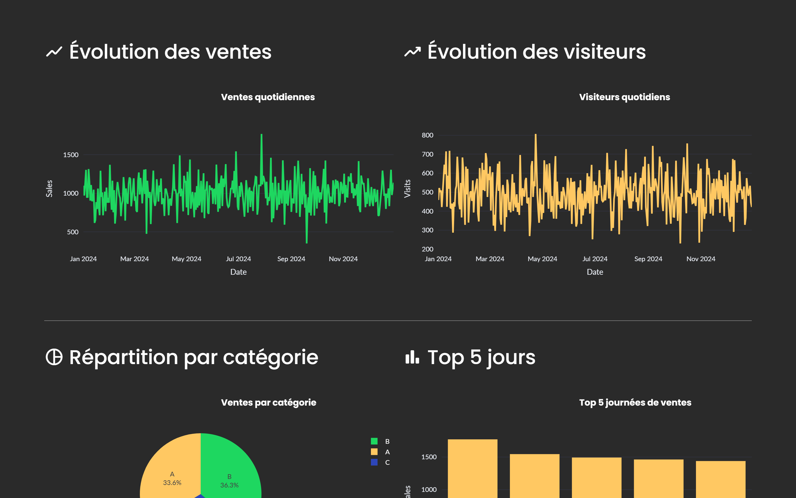
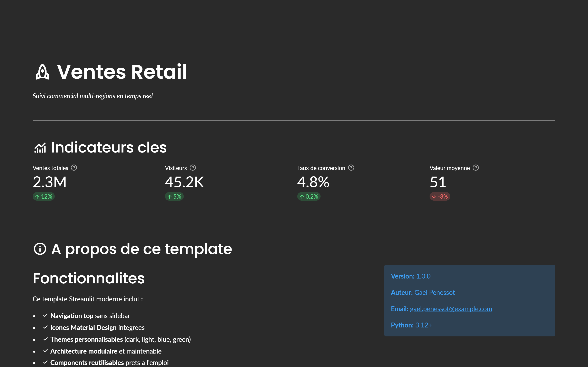
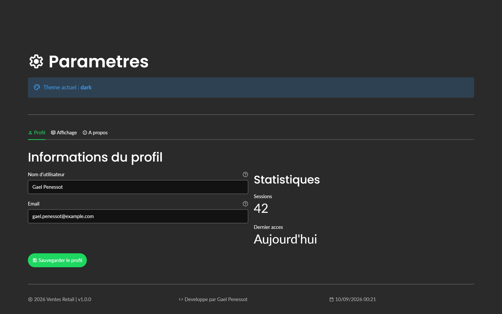

<div align="center">

# StreamlitTurbo

### Arrêtez de recommencer vos projets Streamlit de zéro.

**Un template professionnel, généré en 30 secondes.**
Architecture propre, thème soigné, outillage moderne — déjà là.

[](https://streamlit.io)
[](https://python.org)
[](https://github.com/astral-sh/uv)
[](LICENSE)

</div>

---

## Vous vous reconnaissez ?

Vous avez une idée d'app. Vous ouvrez un terminal. Et là :

- **Vous repartez d'un `app.py` vide.** Encore. Comme les six fois d'avant. Et vous
  allez recopier la moitié du dernier projet en priant pour ne rien oublier.
- **Votre app devient un plat de spaghettis à la 3e page.** Tout dans un fichier,
  les graphiques dupliqués, un `if page ==` de 200 lignes.
- **Vous ne savez pas ce qu'est « bien faire ».** `src/` ou pas ? Où mettre les
  composants ? `requirements.txt` ou `pyproject.toml` ? Personne ne vous l'a montré.
- **Votre app a l'air d'un prototype.** Le thème par défaut, la sidebar grise, les
  emojis en guise d'icônes. Fonctionnel, mais impossible à montrer à un client.
- **Le déploiement vous surprend à chaque fois.** Streamlit Cloud veut un
  `requirements.txt`, vous avez un `pyproject.toml`, et il est 23h.

**Le coût réel : environ 4 heures perdues avant d'écrire votre première ligne
utile.** À chaque projet.

---

## Ce que vous obtenez instantanément

Une seule commande, et vous démarrez à l'étape 12 au lieu de l'étape 1.

### Une architecture que vous n'avez pas à inventer

Le layout `src/` que la communauté Python utilise, appliqué à Streamlit : pages,
composants et utilitaires séparés. Ajouter une 8e page ne casse rien.
**Fini le fichier de 2000 lignes.**

### Une app qui a l'air finie, pas prototypée

Quatre thèmes prêts (Spotify dark, Eclair light, Corporate blue, Nature green),
polices **Poppins + Lato** embarquées, icônes **Material Design**, navigation en
haut de page. **Montrable à un client dès la première minute.**

### Huit composants graphiques réutilisables

`create_line_chart()`, `create_pie_chart()`, `create_gauge_chart()`… Vous appelez
une fonction, vous ne recopiez plus 40 lignes de `update_layout()`. Et ils prennent
automatiquement la palette du thème choisi — **aucune couleur en dur à maintenir**.
**Plus 20 fonctions utilitaires** : formatage FR, calculs de croissance, export CSV,
cache.

### Un outillage 2026 déjà branché

**uv** pour des installations quasi instantanées, **just** pour les commandes,
**ruff** pour le format et le lint, **pytest** avec des tests d'exemple.
`just check` passe au vert dès la génération. **Zéro configuration à écrire.**

### Un déploiement sans surprise

`just requirements` génère le `requirements.txt` figé que Streamlit Cloud attend —
et un `requirements.txt` fonctionnel est déjà livré. **Vous poussez, ça marche.**

### Un template qui vieillit avec vous

Basé sur **Copier** : `copier update` récupère les améliorations du template dans
vos projets déjà démarrés. **Pas un copier-coller mort.**

---

## Aperçu

**Dashboard** — filtres par date et catégorie, KPI, 5 graphiques Plotly, export CSV.
Chaque graphique est un appel de fonction, pas 40 lignes de `update_layout()`.



| Accueil | Paramètres |
|---|---|
|  |  |
| Navigation en haut, KPI, présentation | Onglets, préférences en session |

_Thème Spotify dark, polices Poppins + Lato, icônes Material, graphiques accordés à
la palette du thème — sortie de génération, sans une ligne de CSS._

---

## Démarrage en 3 minutes

### Prérequis

```bash
pip install uv          # gestionnaire de paquets ultra-rapide
uv tool install copier  # générateur de projet
```

`just` est optionnel mais recommandé — [comment l'installer](#faq).

### Générer votre projet

```bash
copier copy https://github.com/gpenessot/StreamlitTurbo.git mon-app
cd mon-app
```

Copier vous pose six questions (nom, description, auteur, version de Python,
thème) et écrit le projet complet.

### Lancer

```bash
just setup   # crée le venv, installe tout (prod + dev)
just run     # ouvre l'app dans le navigateur
```

**Sans `just` :**

```bash
uv sync && uv run streamlit run main.py

# ou, sans uv :
pip install -r requirements.txt && streamlit run main.py
```

---

## Dans la boîte

```
mon-app/
├── main.py                    # Point d'entrée : navigation top
├── pyproject.toml             # Dépendances (source de vérité)
├── requirements.txt           # Figé pour Streamlit Cloud
├── justfile                   # Toutes les commandes du projet
├── .streamlit/config.toml     # Thème, polices, couleurs de graphiques
├── src/mon_app/
│   ├── pages/                 # 1_home · 2_dashboard · 3_settings
│   ├── components/            # charts · footer · sidebar
│   └── utils/                 # 20 fonctions utilitaires
├── data/sample_data.csv       # Données d'exemple
└── tests/                     # Tests pytest
```

### Les commandes

| Commande | Effet |
|---|---|
| `just run` | Lance l'application |
| `just dev` | Lance avec rechargement auto |
| `just check` | Formate **et** vérifie le code (ruff) |
| `just test` | Lance les tests (pytest) |
| `just add pandas` | Ajoute une dépendance |
| `just requirements` | Régénère `requirements.txt` avant déploiement |
| `just help` | Affiche toutes les commandes |

---

## Déploiement

**Streamlit Community Cloud**, en trois commandes :

```bash
just requirements
git add . && git commit -m "Ready for deployment"
git push
```

Puis sur [share.streamlit.io](https://share.streamlit.io) : connectez le repo,
sélectionnez `main.py`, **Deploy**.

> **La règle à retenir :** modifiez toujours `pyproject.toml`, jamais
> `requirements.txt` à la main. Régénérez-le avec `just requirements` avant chaque
> déploiement.

Fonctionne aussi sur Railway, Render, Heroku, AWS / GCP / Azure.

---

## Et si vous voulez aller plus loin

Ce template couvre le démarrage d'un projet. Il s'arrête volontairement là où
commencent les vraies questions de production.

| | **StreamlitTurbo** (ce repo) | **Streamlit Unleashed** |
|---|:---:|:---:|
| Architecture modulaire | Oui | Enterprise, multi-modules |
| Thèmes & design | 4 thèmes | Design system complet |
| Composants graphiques | 8 | Bibliothèque étendue |
| Tests | Exemples | Suite complète + couverture |
| Authentification | — | Système complet |
| Base de données | — | Connecteurs + ORM |
| CI/CD | — | GitHub Actions prêtes |
| Déploiement | Manuel | 1-click |
| Monitoring & analytics | — | Intégrés |
| Performance & cache avancé | — | Patterns de scaling |

<div align="center">

### [Découvrir Streamlit Unleashed](https://www.mes-formations-data.fr/formation/streamlit-unleashed)

_La formation complète : de l'app qui marche à l'app qui tient en production._

</div>

---

## FAQ

<details>
<summary><b>Pourquoi Copier et pas un simple <code>git clone</code> ?</b></summary><br>

Un clone est mort à la seconde où vous le faites. Copier remplace les noms,
l'auteur, le thème et la version de Python **partout** dans le projet. Surtout,
`copier update` vous permet de récupérer plus tard les correctifs du template dans
un projet déjà bien avancé.
</details>

<details>
<summary><b>Je n'utilise ni <code>uv</code> ni <code>just</code>, c'est bloquant ?</b></summary><br>

Non. `pip install -r requirements.txt && streamlit run main.py` fonctionne, le
`requirements.txt` livré est complet. `uv` et `just` accélèrent le travail, ils ne
sont pas obligatoires.
</details>

<details>
<summary><b>Pourquoi la navigation est en haut et pas dans la sidebar ?</b></summary><br>

`st.navigation(position="top")` libère toute la largeur pour vos données, ce qui
compte sur un dashboard. Un composant `sidebar.py` est fourni si vous préférez :
appelez `render_sidebar()` et passez `initial_sidebar_state="expanded"` dans
`main.py`.
</details>

<details>
<summary><b>Je peux changer de thème après la génération ?</b></summary><br>

Oui. Tout est dans `.streamlit/config.toml` — couleurs, polices, rayons, palette
des graphiques. Éditez, rechargez. Pas besoin de régénérer le projet.
</details>

<details>
<summary><b>Quelles versions sont supportées ?</b></summary><br>

Python 3.11 à 3.14, Streamlit 1.50+. Le template utilise des fonctionnalités
récentes (navigation top, polices personnalisées, thème de sidebar) qui demandent
Streamlit 1.50 au minimum.
</details>

<details>
<summary><b>Comment installer <code>just</code> ?</b></summary><br>

```bash
# Windows
scoop install just        # ou : winget install --id Casey.Just

# macOS
brew install just

# Linux
sudo apt install just     # Debian/Ubuntu
sudo dnf install just     # Fedora
sudo pacman -S just       # Arch
```

[Toutes les options d'installation](https://github.com/casey/just#installation)
</details>

---

## Ressources

[Documentation Streamlit](https://docs.streamlit.io) ·
[Galerie](https://streamlit.io/gallery) ·
[Forum](https://discuss.streamlit.io) ·
[uv](https://github.com/astral-sh/uv) ·
[just](https://github.com/casey/just) ·
[Copier](https://copier.readthedocs.io)

## Contact

[gael.penessot@gmail.com](mailto:gael.penessot@gmail.com) ·
[LinkedIn](https://www.linkedin.com/in/gael-penessot/) ·
[Issues](https://github.com/gpenessot/StreamlitTurbo/issues)

## Licence

[MIT](LICENSE) — libre d'utilisation et de modification.

---

<div align="center">

**Créé par [Gaël Penessot](https://www.mes-formations-data.fr)**

Ce template vous fait gagner du temps ? Mettez-lui une étoile.

</div>
